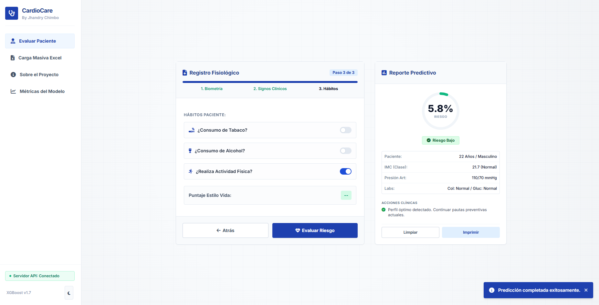
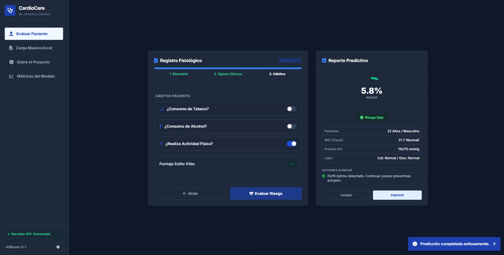

# CardioGuard AI - Diagnóstico Clínico Predictivo
¡Bienvenido a **CardioGuard AI** (también conocido como CardioCare)! Este proyecto es una plataforma médica de diagnóstico predictivo diseñada para la evaluación clínica del riesgo cardiovascular. Utiliza modelos avanzados de Machine Learning (XGBoost) entrenados con ingeniería de características (*Feature Engineering*) especializada para ofrecer predicciones precisas sobre el riesgo de un paciente.

Desarrollado por **Jhandry Chimbo**.

---

## 📸 Vista de la Aplicación

| Modo Claro |
| :---: |
|  |

| Modo Oscuro |
| :---: |
|  |

---

## ✨ Características Principales
- **Evaluación Individual Asistida**: Un formulario guiado (Wizard Form) estructurado en 3 pasos (Biometría, Signos Clínicos y Hábitos de vida) con validaciones fisiológicas en tiempo real.
- **Inferencia en Tiempo Real**: Conexión con un backend de inferencia rápida en FastAPI utilizando un modelo predictivo XGBoost (`XGBoost v1.7`).
- **Carga Masiva de Pacientes (Batch Ingestion)**: Interfaz intuitiva para arrastrar y soltar un archivo de Excel (`.xlsx` o `.xls`), evaluando decenas de pacientes simultáneamente con generación automática de métricas promedio y exportación de resultados evaluados.
- **Reportes Clínicos Imprimibles**: Vista optimizada para la impresión física o guardado en PDF de reportes clínicos individuales detallados.
- **Selector de Servidor Dinámico**: Ajuste en caliente de la URL del servidor API (local o producción) directamente desde la barra lateral sin necesidad de modificar el código fuente.
- **Visualización de Métricas del Modelo**: Panel con las curvas de entrenamiento, matriz de confusión y métricas de desempeño del modelo.

---

## 🛠️ Stack Tecnológico

### Backend
- **Framework**: [FastAPI](https://fastapi.tiangolo.com/) (Python)
- **Modelado**: [XGBoost](https://xgboost.readthedocs.io/), [Scikit-Learn](https://scikit-learn.org/), [Joblib](https://joblib.readthedocs.io/)
- **Procesamiento de Datos**: [Pandas](https://pandas.pydata.org/), [NumPy](https://numpy.org/)
- **Servidor ASGI**: [Uvicorn](https://www.uvicorn.org/)

### Frontend
- **Estructura y Animaciones**: HTML5, Vanilla JavaScript, CSS3
- **Estilos**: TailwindCSS (CDN)
- **Iconos**: FontAwesome v6
- **Lectura/Escritura de Excel**: SheetJS (`xlsx`)

---

## 📁 Estructura del Proyecto

```bash
Web_Cardiovascular/
├── backend/
│   ├── best_model_XGB.joblib  # Modelo entrenado de XGBoost
│   ├── scaler.joblib          # Escalador de datos (StandardScaler)
│   ├── main.py                # Servidor FastAPI
│   └── requirements.txt       # Dependencias de Python
├── frontend/
│   └── index.html             # Interfaz web de usuario (SPA)
├── img/
│   ├── lm-paciente.png        # Captura de pantalla en modo claro
│   └── dm-paciente.png        # Captura de pantalla en modo oscuro
├── render.yaml                # Especificación de Render Blueprint (despliegue unificado)
├── vercel.json                # Configuración de ruteo estático para Vercel
└── README.md                  # Este documento
```

---

## 💻 Configuración Local

### Prerrequisitos
- Python 3.10 o superior instalado.
- Un navegador web moderno.

### 1. Levantar el Backend
1. Navega al directorio del backend:
   ```bash
   cd backend
   ```
2. Crea un entorno virtual e instálalo:
   ```bash
   python -m venv venv
   # En Windows
   .\venv\Scripts\activate
   # En macOS/Linux
   source venv/bin/activate
   ```
3. Instala las dependencias:
   ```bash
   pip install -r requirements.txt
   ```
4. Inicia el servidor de desarrollo:
   ```bash
   uvicorn main:app --reload --port 8000
   ```
   El backend estará disponible en `http://localhost:8000`.

### 2. Abrir el Frontend
Dado que el frontend es puramente HTML/JS estático, puedes abrir directamente el archivo `frontend/index.html` en tu navegador, o levantarlo con una extensión de servidor local como *Live Server* en VSCode.

---

## 🚀 Despliegue en Producción

El proyecto está 100% optimizado para la nube:
- **Backend**: Despliegue en **Render** como Web Service en la capa gratuita.
- **Frontend**: Despliegue en **Vercel** o en **Render Static Site**.

Para ver las instrucciones detalladas paso a paso sobre cómo realizar la conexión, consulta la **[Guía de Despliegue](./deployment_guide.md)** en el directorio de la aplicación.
